# Perfilamiento de viajes en tranporte público en Santiago
Código para analizar y perfilar los viajes hechos en el transporte público de Santiago a partir de las [matrices origen-destino](https://www.dtpm.cl/index.php/documentos/matrices-de-viaje) recolectadas por el [Directorio de Transporte Público Metropolitano](https://www.dtpm.cl). Este trabajo surge a partir del proyecto final del curso *Ciencia de datos geográficos* en la U. De Chile.

## Contexto
En el sistema actual de transporte público de Santiago (RED), muchos de los viajes largos tienden a requerir al menos un transbordo (sobre todo desde micros), con tiempos de viaje pueden llegar a durar hasta 2 horas o más dentro del área metropolitana. Esto afecta más a usuarios de comunas periféricas o sectores más alejados a estaciones de metro.

## Datos

**Matrices de Viaje**: Matrices origen-destino (OD) y datos de subidas y bajadas, obtenidos de registros de tarjetas Bip y GPS de los buses mediante software ADATRAP y metodologías desarrollados en conjunto por la UCH y DTPM.

#### Tablas:
 - Viajes: cada fila corresponde a un viaje realizado, se incluye información como: paraderos, medios usados, n° de etapas, hora, tiempos, distancias, propósito, etc.
 - Etapas: información más detallada de las etapas de los viajes, coordenadas exactas, si es en hora punta
 - Zonas: Diccionario de referencia con información sobre paraderos/est. de metro y sus coordenadas. También se incluye el promedio de subidas y bajadas totales por día laboral.

Las matrices utilizadas fueron las de Abril y Agosto de 2022.

## Resultados principales
### Vista General
#### Cantidad de viajes por comuna
Subida            |  Bajada
:-------------------------:|:-------------------------:
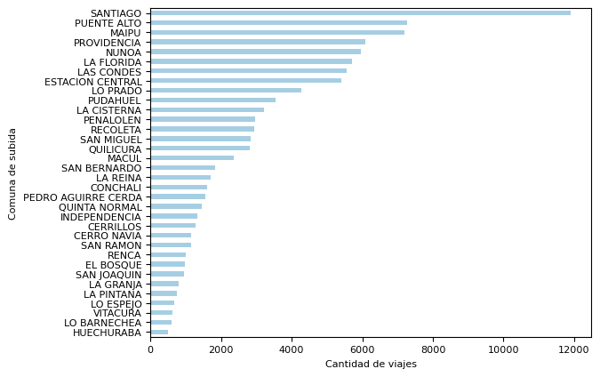  |  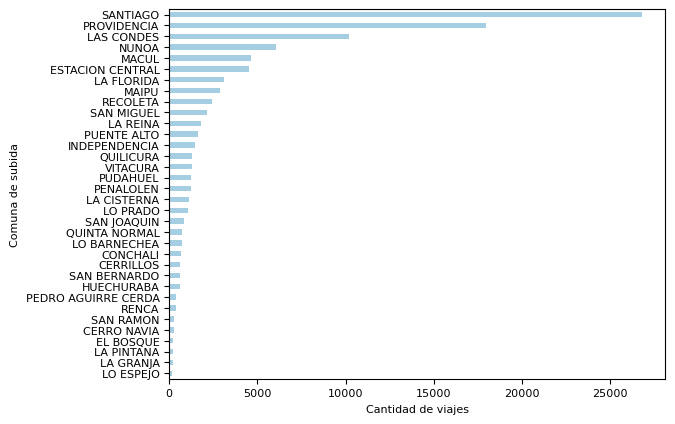

#### Promedio tiempo de viaje (min.) por comuna  (viajes con propósito "TRABAJO")
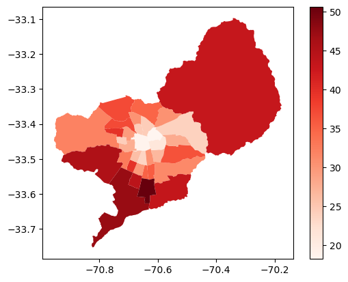

#### Promedio n° de etapas
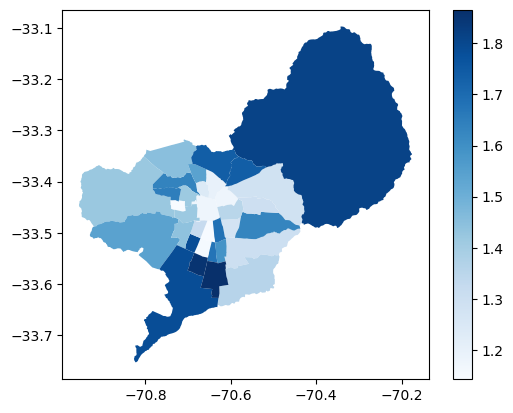

#### Medio utilizado en la primera etapa
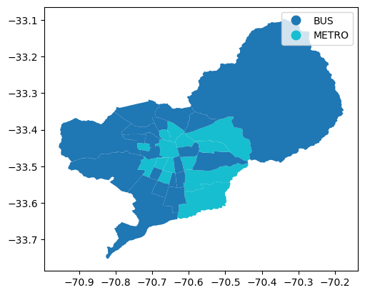

### Segmentación de viajes
Se trabajó con viajes con propósito "TRABAJO". El número de clusters se eligió analizando el método del codo y dendogramas. Se utilizaron los algoritmos *k-means* y *Agglomerative Clustering*, que entregaron segmentaciones muy similares.

Principalmente tenemos 3 grupos, caracterizados por comuna de origen vs. destino. Una parte importante de los viajes hechos con propósito "trabajo" tiene un tiempo de ~45 minutos. 

Es importante considerar que debido a la evasión del pasaje muchos viajes no quedan registrados (sobre todo en comunas con mayor evasión).

#### Dendograma

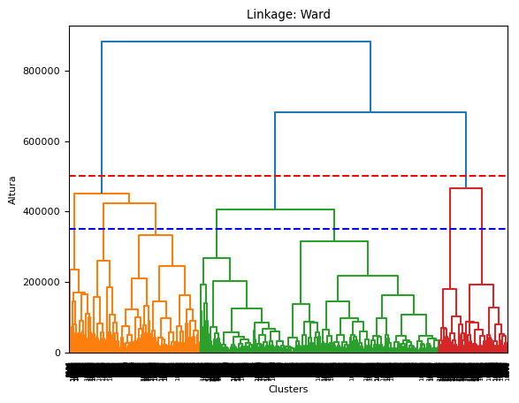

Los grupos mostrados a continuación corresponden clusters de *k-means* y corresponden a una muestra de 10.000 viajes.

#### Desplazamiento (Grupo 0)
Subida            |  Bajada
:-------------------------:|:-------------------------:
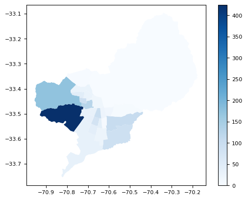  |  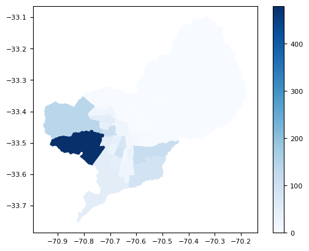

#### Desplazamiento (Grupo 1)
Subida            |  Bajada
:-------------------------:|:-------------------------:
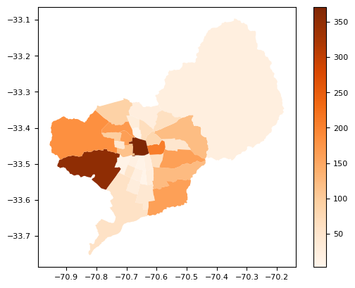  |  

#### Desplazamiento (Grupo 2)
Subida            |  Bajada
:-------------------------:|:-------------------------:
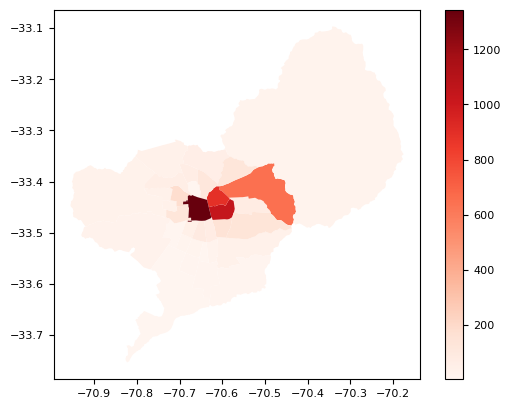  |  

#### Frecuencia acumulada durante el día (horario truncado a la última media hora)
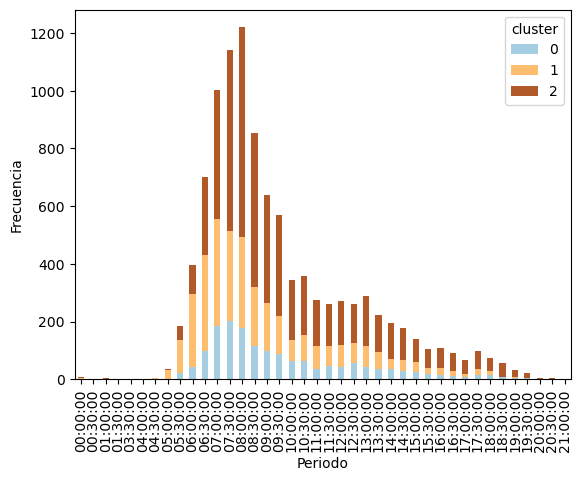  |  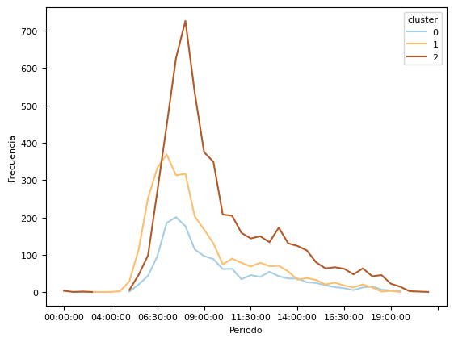

#### Segmentación por comuna
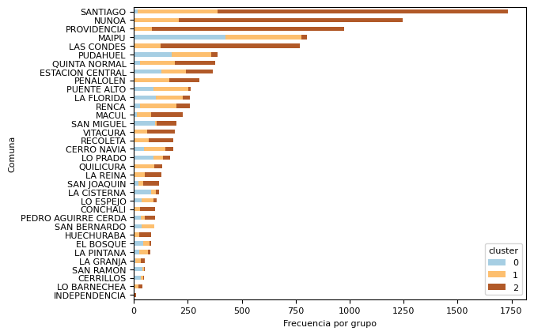

#### N° de etapas por grupo
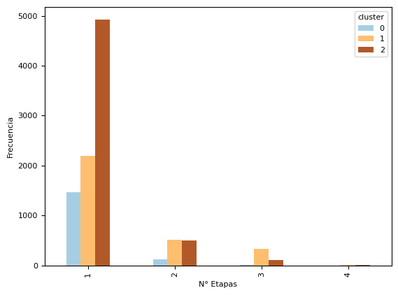

#### Tiempo y distancia de viaje promedio por grupo
Tiempo            |  Distancia euclidiana
:-------------------------:|:-------------------------:
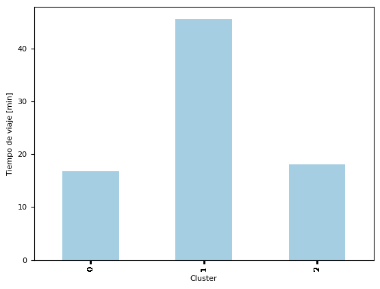  |  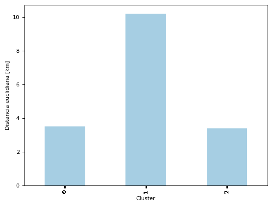

